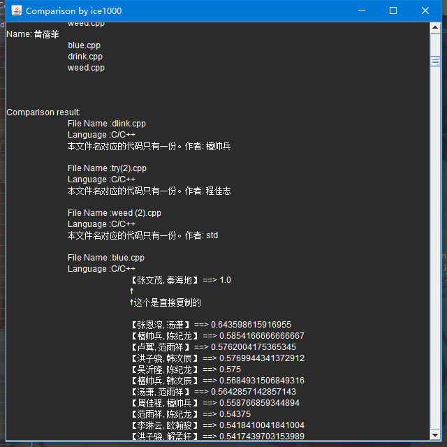
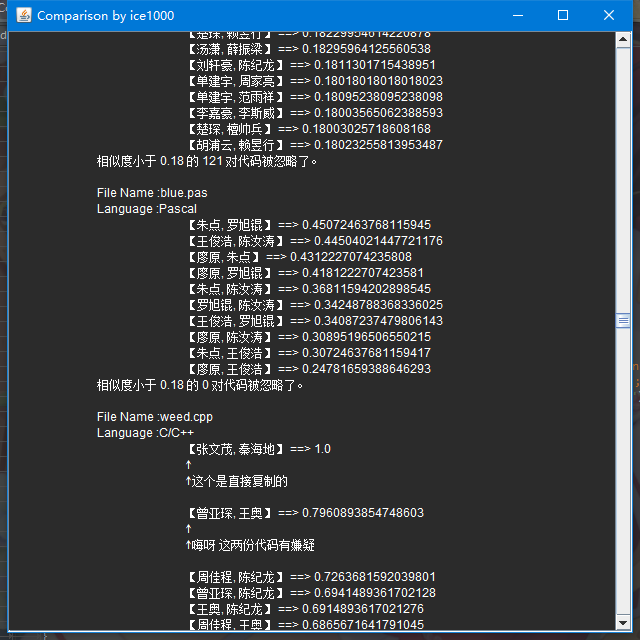

# CodeCompare

A simple tool used to compare OI codes.

# Usage

Unfortunately, you have to install JRE8.

Download the jar in the [release page](https://github.com/CDFLS/CodeCompare/releases).<br/>
Before running it, your should sort your files like this:

mention: cjj, ice, yzh, yoto are name of OIers.

```
root
|   source
|   |   cjj
|   |   |   boy.cpp
|   |   |   next.cpp
|   |   |   door.py
|   |
|   |   ice
|   |   |   boy.java
|   |   |   next.java
|   |   |   door.java
|   |
|   |   yzh
|   |   |   boy.cpp
|   |   |   next.cpp
|   |   |   door.py
|   |
|   |   yoto
|   |   |   boy.java
|   |   |   next.cpp
|
|   Compare.jar
```

These languages are supported:
+ Python(.py)
+ Java(.java)
+ Pascal(.pas)
+ C/C++(.c/.cpp)

Then double click to execute it. Or run it in console(you will see the command line debug output):

```bash
$ java -jar Compare.jar
```

And then you get the output.

 <br/>

